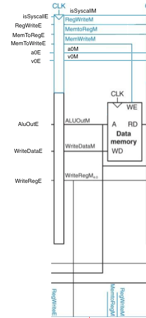

**Team USB**

Peter Unrein, Elias Strizower, and Yash Bhutwala

# Project 2: Pipelined CPU

The pipelined MIPS CPU was developed in Verilog. It was developed in a modular format allowing specificity of the modules created, which were then connected together with a top module.

## Design

### Overview

All input and output is handled by the top module. The top module has one one-bit input, clk. From there the top module creates wires which are used to connect other modules within the top module which represent the different stages of the pipeline. The pipeline was broken down into the fetch, decode, execute, memory, and writeback stages, called F, D, E, M, W, respectively. In addition to the stages of the pipeline there is also a hazard module which handles the hazard detection. The breakdown of the stages are as follows:

#### Stages

##### Fetch

The fetch module contains a multiplexer, pipeline register, arithmetic logic unit, and an instruction memory. All of these pieces, in addition to input, output, and wires, connected together perform the correct behavior of the decode stage of the pipeline.


##### Decode

The decode module contains a pipeline register, a register file, two multiplexers, control unit, sign extender, and an arithmetic logic unit. All of these pieces, in addition to input, output, and wires, connected together perform the correct behavior of the decode stage of the pipeline.


##### Execute

The execute module contains a pipeline register, four multiplexers, and an arithmetic logic unit. All of these pieces, in addition to input, output, and wires, connected together perform the correct behavior of the execute stage of the pipeline.


##### Memory

The memory module contains a pipeline register and data memory. These two components, in addition to input, output, and wires, connect together to perform the correct behavior of the memory stage of the pipeline.



##### Write-back

The write-back module contains a pipeline register and multiplexer. These two components, in addition to input, output, and wires, connect together to perform the correct behavior of the write-back stage of the pipeline.


#### Hazard Unit

The hazard unit consists of logic between its inputs and outputs, as well as two internal registers, to handle hazards and forwarding.


## Compilation

There is an included makefile in the project directory. To execute in the terminal, enter:

```bash
>> make clean
>> make all
```

**Note**

_To execute the desired instruction, in module instMem in mips.v load the desired instruction_

_Example:_

```verilog
module instMem(input[29:0] readAddr, output[31:0] memOut);
...
$readmemh("hello.v", mem);		// for helloWorld
...
endmodule
```

## Execution

To execute, in the command prompt enter "./mips"

## Testing

#### Methodology

The main way by which we are testing our code is by analyzing the signals our program produces via GTKWave. GTKWave is used to test each individual module to make sure that it is behaving as expected, as well as the top module after new features are added.

#### Screenshot of GTKWave Simulation


#### Sample Programs

AddTest.v:

```verilog
/* 00000003: add_test.srec */
@00100000 00000314 00000000 00000000 00000000 00000000 00000000
@00100008 24080001 24090002 24020001 01282020 0000000C 2402000A 0000000C
@0010000F 00000000
```

Hello.v:

```verilog
/* 00000003: hello.s */
@00100000 80000004 00000000 00000000 00000000 00000000 00000000
@00100008 24020004 0000000C 03E00008 00000000 3C1D7FFF 0C100014 37BDFFFC
@0010000F 2402000A 0000000C 00000000 00000000 00000000 27BDFFE8 AFBF0014
@00100016 AFBE0010 03A0F021 3C020040 24440090 0C100008 00000000 03C0E821
@0010001D 8FBF0014 8FBE0010 27BD0018 03E00008 00000000 00000000 00000000
@00100024 6C6C6548 6F77206F 21646C72 00000000
```

Output:


